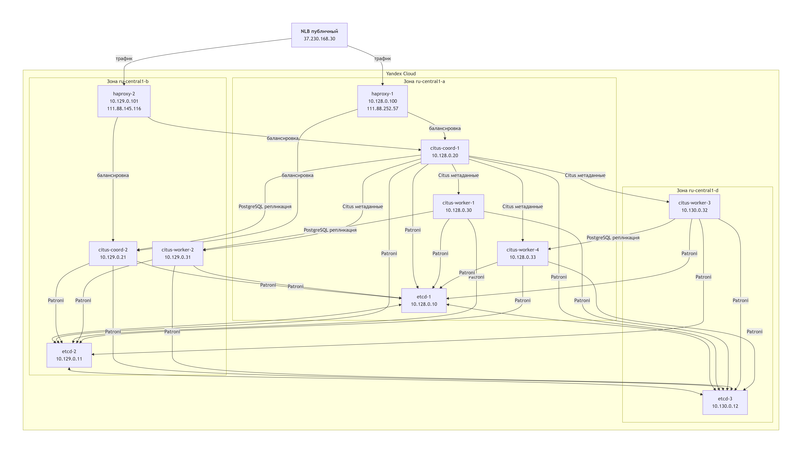
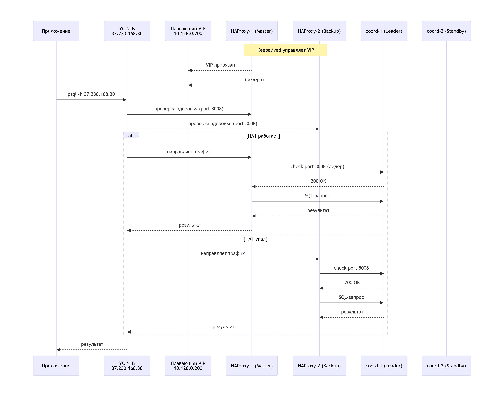
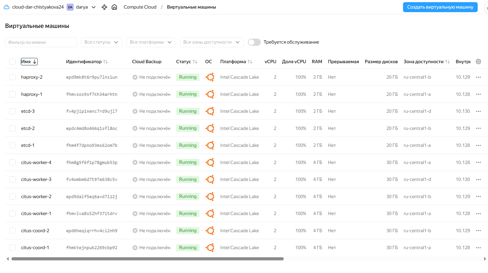
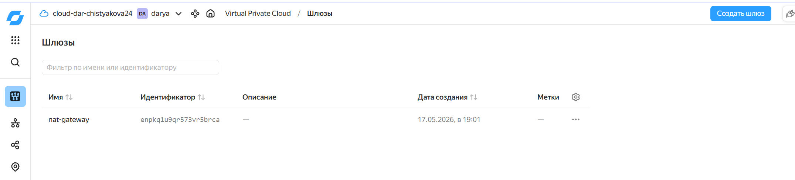
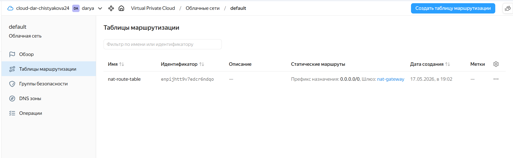

# Построение отказоустойчивого распределённого кластера PostgreSQL на базе Citus и Patroni
Цель – построить отказоустойчивый распределённый кластер PostgreSQL, способный горизонтально масштабироваться, автоматически восстанавливаться после сбоев узлов и предоставлять единую точку входа для приложений

Задачи:
- Развернуть инфраструктуру в Yandex Cloud с распределением по трём зонам доступности 
- Настроить кластер etcd (3 узла) как распределённое хранилище конфигураций (DCS) для Patroni 
- Установить PostgreSQL 16, расширение Citus (шардирование) и Patroni (управление репликацией и failover) на 6 узлах БД 
- Сконфигурировать Patroni для двух групп: координаторы (2 узла) и две группы воркеров (по 2 узла в каждой)
- Проверить работу репликации, автоматического переключения лидера (failover) и распределения шардов Citus 
- Организовать единую точку входа к БД 
- Протестировать отказоустойчивость решения

Используемые технологии:

| Компонент | Назначение |
|-----------|------------|
| PostgreSQL 16 | Реляционная СУБД |
| Citus 12.1 | Расширение для горизонтального шардирования и распределённых запросов |
| Patroni | Управление репликацией, автоматический failover, взаимодействие с etcd |
| etcd 3.5 | Распределённое конфигурационное хранилище (DCS) для Patroni |
| HAProxy 2.8 | Балансировщик TCP-трафика между координаторами |
| Keepalived | Обеспечение плавающего VIP (VRRP) для отказоустойчивости HAProxy |
| Yandex Cloud NLB | Облачной сетевой балансировщик с публичным IP для внешнего доступа |

## Инфраструктура:
- Кластер etcd (3 ВМ): etcd-1, etcd-2, etcd-3. Распределённое хранилище конфигураций (DCS) для Patroni.
- Кластер координаторов (2 ВМ): citus-coord-1 (primary), citus-coord-2 (standby). Patroni управляет репликацией.
- Кластер воркеров (4 ВМ): citus-worker-1 (primary), citus-worker-2 (standby), citus-worker-3 (primary), citus-worker-4 (standby). Patroni управляет двумя группами репликации.
- Балансировщики нагрузки (2 ВМ): haproxy-1 и haproxy-2. Обеспечивают единую точку входа и балансировку нагрузки.

## Архитектура решения
### Общая архитектура (физические узлы и связи)


### Схема балансировки и отказоустойчивости HAProxy/Keepalived/NLB


## Состав и IP-адресация
Детальное описание по созданию ВМ: [vm_creation](vm_creation)
```
yc compute instance list
```
Результат:
```
PS C:\Users\Дарья\PycharmProjects\PostgreSQL.Advanced> yc compute instance list
+----------------------+----------------+---------------+---------+----------------+--------------+
|          ID          |      NAME      |    ZONE ID    | STATUS  |  EXTERNAL IP   | INTERNAL IP  |
+----------------------+----------------+---------------+---------+----------------+--------------+
| epd6heqiqrrhv4ci2nh9 | citus-coord-2  | ru-central1-b | RUNNING |                | 10.129.0.21  |
| epd9daif5eq6avd7i12j | citus-worker-2 | ru-central1-b | RUNNING |                | 10.129.0.31  |
| epd9mk8t6r9pu7lns1un | haproxy-2      | ru-central1-b | RUNNING | 111.88.145.116 | 10.129.0.101 |
| epdc4md8o466q1sfl8oc | etcd-2         | ru-central1-b | RUNNING |                | 10.129.0.11  |
| fhm4f7dpno93ms62om7b | etcd-1         | ru-central1-a | RUNNING |                | 10.128.0.10  |
| fhm8g5f6f1p78gmub53p | citus-worker-4 | ru-central1-a | RUNNING |                | 10.128.0.33  |
| fhmktejnpub2269cbp92 | citus-coord-1  | ru-central1-a | RUNNING |                | 10.128.0.20  |
| fhmvlva8s52hf371tdrv | citus-worker-1 | ru-central1-a | RUNNING |                | 10.128.0.30  |
| fhmvsos9sf7kh34arhtn | haproxy-1      | ru-central1-a | RUNNING | 111.88.252.57  | 10.128.0.100 |
| fv4ombm6d7t97e638c5v | citus-worker-3 | ru-central1-d | RUNNING |                | 10.130.0.32  |
| fv4pjip1nenc7rd9ujl7 | etcd-3         | ru-central1-d | RUNNING |                | 10.130.0.12  |
+----------------------+--------
```


## Доступ через бастион
Копирование ключа на haproxy-1:
```
scp -i "C:\Users\дарья\.ssh\bananaflow" "C:\Users\дарья\.ssh\bananaflow" yc-user@111.88.252.57:~/.ssh/
```
Подключение к haproxy-1:
```
ssh -i "C:\Users\дарья\.ssh\bananaflow" yc-user@111.88.252.57
```
Выдача прав на файлы с ключами:
```
chmod 700 ~/.ssh
chmod 600 ~/.ssh/bananaflow
```
Подключение с haproxy-1 на etcd-1:
```
ssh -i ~/.ssh/bananaflow yc-user@10.128.0.10
```
## Настройка NAT-шлюза 
- ВМ без публичных IP по умолчанию не имеют выхода в интернет. Для установки пакетов и обновлений был создан NAT-шлюз и маршруты для подсетей.

```
yc vpc gateway create --name nat-gateway
yc vpc route-table create --name nat-route-table --network-id enpbkb3naph9ecm0knp9 --route destination=0.0.0.0/0,gateway-id=enpkq1u9qr573vr5brca
yc vpc subnet update default-ru-central1-a --route-table-name nat-route-table
yc vpc subnet update default-ru-central1-b --route-table-name nat-route-table
yc vpc subnet update default-ru-central1-d --route-table-name nat-route-table
```
NAT-шлюз в интерфейсе Яндекса:



# Настройка кластера etcd
Детальное описание: [etcd.md](configs%2Fetcd%2Fetcd.md)
- На каждом из трёх узлов установлен пакет etcd-server.
- Создан конфигурационный файл /etc/default/etcd с параметрами имени узла, адресов и списка кластера.
- Запущены сервисы, проверена работа командой etcdctl member list (см. скриншоты img_1.png–img_4.png в разделе про etcd).

# Установка PostgreSQL 16, Citus, Patroni на 6 узлах БД
Детальное описание: [pg-citus-patroni-cluster.md](configs%2Fpg-citus-patroni-cluster%2Fpg-citus-patroni-cluster.md)
- Установка PostgreSQL 16, добавление репозитория Citus, замена noble на jammy
- Установка пакетов postgresql-16-citus-12.1, python3-pip
- Установка Patroni: pip install patroni[etcd] psycopg2-binary
- Остановка и отключение стандартного PostgreSQL

# Конфигурация Patroni
Детальное описание: [pg-citus-patroni-cluster.md](configs%2Fpg-citus-patroni-cluster%2Fpg-citus-patroni-cluster.md)
Для координаторов и воркеров созданы файлы /etc/patroni.yml с использованием etcd3 (вместо etcd)
- У координаторов – scope: citus_coord, citus.group: 0
- У воркеров первой группы – scope: citus_worker_1, citus.group: 1
- У воркеров второй группы – scope: citus_worker_2, citus.group: 2 
В секцию bootstrap добавлен post_init скрипт, который при первой инициализации создаёт пользователя replicator, задаёт пароль postgres и активирует расширение Citus

# Запуск кластера и проверка репликации
Детальное описание: [pg-citus-patroni-cluster.md](configs%2Fpg-citus-patroni-cluster%2Fpg-citus-patroni-cluster.md)
Создан systemd-сервис patroni.service на всех узлах. Порядок запуска:
- Сначала лидеры: coord-1, worker-1, worker-3
- Затем реплики: coord-2, worker-2, worker-4
После запуска проверяем состояние командой sudo patronictl -c /etc/patroni.yml list

- Результат – все узлы в состоянии running (лидеры) или streaming (реплики)

# Тестирование распределённой работы Citus
Детальное описание: [query.md](configs%2Fpg-citus-patroni-cluster%2Fquery.md)
На координаторе выполнен ряд SQL-запросов, демонстрирующих шардирование и распределённую обработку:
- Проверка активных воркеров (citus_get_active_worker_nodes())
- Создание распределённой таблицы test
- Вставка 10000 строк суммарно 
- Просмотр шардов (pg_dist_shard) и их расположения (pg_dist_placement)
- Планы выполнения запросов с показом всех задач (citus.explain_all_tasks = on).

# Обеспечение высокой доступности точки входа (HAProxy + Keepalived + NLB)
Детальное описание: [haproxy.md](configs%2Fhaproxy%2Fhaproxy.md)
- Настроены два экземпляра HAProxy (на haproxy-1 и haproxy-2) с одинаковой конфигурацией, направляющей трафик на активный координатор через проверку порта 8008
- С помощью Keepalived создан внутренний плавающий VIP 10.128.0.200, который автоматически переключается между HAProxy
- Для доступа из интернета развёрнут Network Load Balancer (NLB) с публичным IP 37.230.168.30. NLB проверяет здоровье координаторов на порту 8008 и направляет трафик на работающий HAProxy

# Итоговая реализация
- Рабочий кластер из 6 серверов PostgreSQL, объединённых в 3 группы (координаторы + 2 группы воркеров)
- Patroni управляет репликацией: при остановке лидера Patroni автоматически переключает роль на реплику (проверено на координаторах и воркерах)
- Citus распределяет данные: создана шардированная таблица test, шарды равномерно размещены на двух группах воркеров
- Единая точка входа: HAProxy + Keepalived создают плавающий внутренний VIP 10.128.0.200, а облачный NLB с публичным IP 37.230.168.30 направляет трафик на работающий HAProxy
- Отказоустойчивость подтверждена: остановка HAProxy на мастер-узле не прерывает подключение к базе; остановка лидера координатора или воркера не приводит к потере данных – кластер продолжает обрабатывать запросы 

# Выводы
1. Связка Patroni + etcd обеспечивает надёжное управление репликацией и автоматический failover в PostgreSQL
2. Citus позволяет горизонтально масштабировать базу данных путём шардирования без изменений прикладного кода
3. Сочетание HAProxy + Keepalived + облачного NLB даёт полноценную отказоустойчивую балансировку нагрузки как внутри сети, так и из интернета 
4. Развёртывание в трёх зонах доступности Yandex Cloud повышает устойчивость к сбоям инфраструктуры
5. Полученная архитектура может служить шаблоном для построения production-решений высокой доступности


