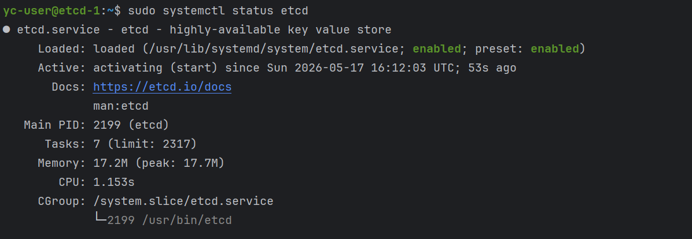
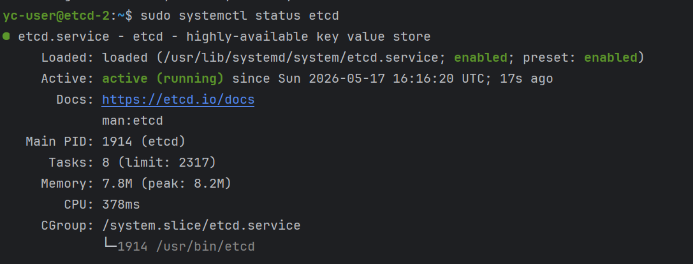
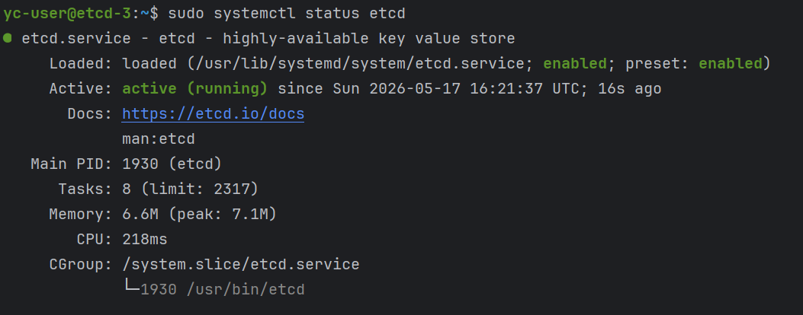
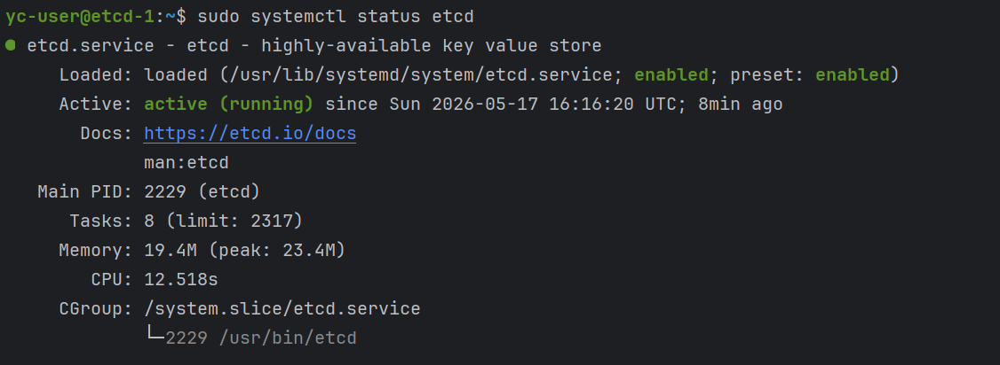
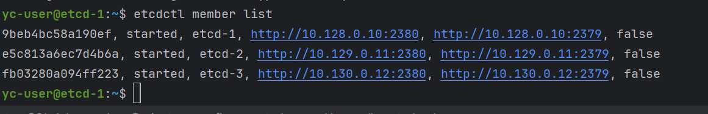

# Настройка кластера etcd
etcd — распределённое хранилище ключ-значение, которое Patroni использует как Distributed Configuration Store для отслеживания состояния кластера, выбора лидера и координации failover

Устанавливаем пакет etcd-server, останавливаем сервис, чтобы подготовить конфигурацию: 
```
ssh -i ~/.ssh/bananaflow yc-user@10.128.0.10
sudo apt update
sudo apt install -y etcd-server
sudo systemctl stop etcd
sudo nano /etc/default/etcd
```
- ETCD_LISTEN_PEER_URLS – адрес и порт для общения между узлами etcd (порт 2380)
- ETCD_LISTEN_CLIENT_URLS – адрес и порт для клиентских подключений (порт 2379)

```
ETCD_NAME="etcd-1"
ETCD_DATA_DIR="/var/lib/etcd"
ETCD_LISTEN_PEER_URLS="http://0.0.0.0:2380"
ETCD_LISTEN_CLIENT_URLS="http://0.0.0.0:2379"
ETCD_INITIAL_ADVERTISE_PEER_URLS="http://10.128.0.10:2380"
ETCD_INITIAL_CLUSTER="etcd-1=http://10.128.0.10:2380,etcd-2=http://10.129.0.11:2380,etcd-3=http://10.130.0.12:2380"
ETCD_INITIAL_CLUSTER_STATE="new"
ETCD_INITIAL_CLUSTER_TOKEN="patroni-etcd-cluster"
ETCD_ADVERTISE_CLIENT_URLS="http://10.128.0.10:2379"
```
Очищаем каталог данных, запускаем etcd, добавляем в автозагрузку и проверяем статус
```
sudo rm -rf /var/lib/etcd/*
sudo systemctl start etcd
sudo systemctl enable etcd
sudo systemctl status etcd 
```

```
exit
```
По аналогии делаем с 2-умя другими нодами:
```
ssh -i ~/.ssh/bananaflow yc-user@10.129.0.11
sudo apt update
sudo apt install -y etcd-server
sudo systemctl stop etcd
sudo nano /etc/default/etcd
```
```
ETCD_NAME="etcd-2"
ETCD_DATA_DIR="/var/lib/etcd"
ETCD_LISTEN_PEER_URLS="http://0.0.0.0:2380"
ETCD_LISTEN_CLIENT_URLS="http://0.0.0.0:2379"
ETCD_INITIAL_ADVERTISE_PEER_URLS="http://10.129.0.11:2380"
ETCD_INITIAL_CLUSTER="etcd-1=http://10.128.0.10:2380,etcd-2=http://10.129.0.11:2380,etcd-3=http://10.130.0.12:2380"
ETCD_INITIAL_CLUSTER_STATE="new"
ETCD_INITIAL_CLUSTER_TOKEN="patroni-etcd-cluster"
ETCD_ADVERTISE_CLIENT_URLS="http://10.129.0.11:2379"
```
```
sudo rm -rf /var/lib/etcd/*
sudo systemctl start etcd
sudo systemctl enable etcd
sudo systemctl status etcd 
```

```
exit
```
```
ssh -i ~/.ssh/bananaflow yc-user@10.130.0.12
sudo apt update
sudo apt install -y etcd-server
sudo systemctl stop etcd
sudo nano /etc/default/etcd
```
```
ETCD_NAME="etcd-3"
ETCD_DATA_DIR="/var/lib/etcd"
ETCD_LISTEN_PEER_URLS="http://0.0.0.0:2380"
ETCD_LISTEN_CLIENT_URLS="http://0.0.0.0:2379"
ETCD_INITIAL_ADVERTISE_PEER_URLS="http://10.130.0.12:2380"
ETCD_INITIAL_CLUSTER="etcd-1=http://10.128.0.10:2380,etcd-2=http://10.129.0.11:2380,etcd-3=http://10.130.0.12:2380"
ETCD_INITIAL_CLUSTER_STATE="new"
ETCD_INITIAL_CLUSTER_TOKEN="patroni-etcd-cluster"
ETCD_ADVERTISE_CLIENT_URLS="http://10.130.0.12:2379"
```
```
sudo rm -rf /var/lib/etcd/*
sudo systemctl start etcd
sudo systemctl enable etcd
sudo systemctl status etcd 
```

```
exit
```

Заходим снова на etcd-1, активируем (до этого он не мог найти другие узлы)
```
sudo systemctl start etcd
sudo systemctl enable etcd
sudo systemctl status etcd 
```


Устанавливаем клиент etcd, чтобы выполнять управляющие команды
```
sudo apt install -y etcd-client
etcdctl member list
```
