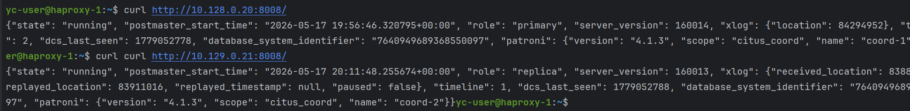
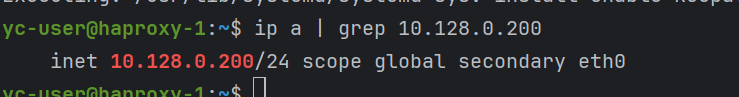
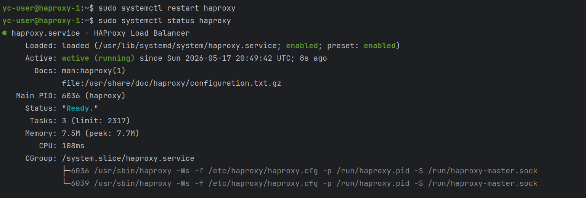
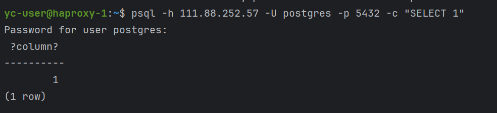
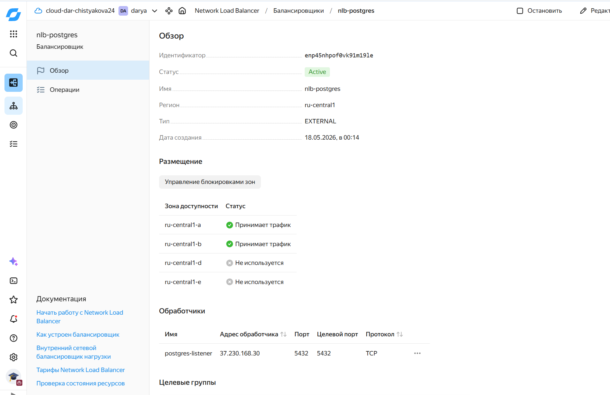

# Обеспечение высокой доступности точки входа (HAProxy + Keepalived + NLB)

Доступ до координаторов:


Устанавливаем HAProxy
```
sudo apt update
sudo apt install -y haproxy
sudo tee /etc/haproxy/haproxy.cfg > /dev/null <<'EOF'
global
    log /dev/log local0
    maxconn 1000

defaults
    log global
    mode tcp
    option tcplog
    retries 2
    timeout connect 5s
    timeout client 60m
    timeout server 60m

listen postgres
    bind *:5432
    mode tcp
    option httpchk OPTIONS /
    default-server inter 3s fall 3 rise 2
    server coord-1 10.128.0.20:5432 check port 8008
    server coord-2 10.129.0.21:5432 check port 8008
EOF
```
Пояснение настроек:
- mode tcp – балансировка на уровне TCP, подходит для PostgreSQL
- option httpchk OPTIONS / – HAProxy будет отправлять HTTP-запрос OPTIONS / на порт 8008 каждого координатора
- Patroni на каждом координаторе слушает порт 8008 и отвечает HTTP 200 OK только если узел является лидером. Благодаря этому HAProxy автоматически направляет трафик только на активный координатор
- inter 3s fall 3 rise 2 – проверка здоровья каждые 3 секунды, 3 неудачи считают узел мёртвым, 2 успеха восстанавливают

После настройки запускаем HAProxy:
```
sudo systemctl enable --now haproxy
```
Keepalived реализует протокол VRRP (Virtual Router Redundancy Protocol) и создаёт виртуальный IP (VIP), который привязан к одному из HAProxy и автоматически переключается на резервный при отказе мастера
```
sudo apt install -y keepalived
sudo tee /etc/keepalived/keepalived.conf > /dev/null <<'EOF'
vrrp_script chk_haproxy {
    script "/usr/bin/killall -0 haproxy"
    interval 2
    weight 2
}

vrrp_instance VI_1 {
    interface eth0
    state MASTER
    priority 150
    virtual_router_id 51
    unicast_src_ip 10.128.0.100
    unicast_peer {
        10.129.0.101
    }
    authentication {
        auth_type PASS
        auth_pass secret
    }
    virtual_ipaddress {
        10.128.0.200/24
    }
    track_script {
        chk_haproxy
    }
}
EOF
```
- state MASTER – этот узел изначально является главным
- priority 150 – выше, чем у резервного, поэтому выигрывает выборы
- virtual_ipaddress { 10.128.0.200/24 } – плавающий IP, который будет привязан к интерфейсу активного HAProxy
- track_script { chk_haproxy } – проверяет, жив ли процесс HAProxy; если нет, Keepalived снижает приоритет или инициирует переключение

Запускаем Keepalived:
```
sudo systemctl restart keepalived
sudo systemctl enable keepalived
```
Проверяем адрес:
```
ip a | grep 10.128.0.200
```


Статус haproxy:


Доступность до PG:


Выполняем похожие настройки на резервной ВМ:
```
ssh -i ~/.ssh/bananaflow yc-user@10.129.0.101
sudo apt update
sudo apt install -y haproxy
sudo tee /etc/haproxy/haproxy.cfg > /dev/null <<'EOF'
global
    log /dev/log local0
    maxconn 1000

defaults
    log global
    mode tcp
    option tcplog
    retries 2
    timeout connect 5s
    timeout client 60m
    timeout server 60m

listen postgres
    bind *:5432
    mode tcp
    option httpchk OPTIONS /
    default-server inter 3s fall 3 rise 2
    server coord-1 10.128.0.20:5432 check port 8008
    server coord-2 10.129.0.21:5432 check port 8008
EOF
```
Конфигурация аналогична, но:
- state BACKUP 
- priority 100

Запуск:
```
sudo systemctl restart haproxy
sudo systemctl enable haproxy
```
Настройка keepalived:
```
sudo apt install -y keepalived
sudo tee /etc/keepalived/keepalived.conf > /dev/null <<'EOF'
vrrp_script chk_haproxy {
    script "/usr/bin/killall -0 haproxy"
    interval 2
    weight 2
}

vrrp_instance VI_1 {
    interface eth0
    state BACKUP
    priority 100
    virtual_router_id 51
    unicast_src_ip 10.129.0.101
    unicast_peer {
        10.128.0.100
    }
    authentication {
        auth_type PASS
        auth_pass secret
    }
    virtual_ipaddress {
        10.128.0.200/24
    }
    track_script {
        chk_haproxy
    }
}
EOF
```
В случае падения мастера:


Хотя внутри сети мы получили отказоустойчивый VIP, для доступа из интернета нужен публичный IP, который будет направлять трафик на HAProxy. Здесь используется Network Load Balancer Yandex Cloud

В целевую группу добавляются оба сервера HAProxy по их внутренним IP (из разных подсетей)
```
yc load-balancer target-group create --name nlb-target-group --target subnet-name=default-ru-central1-a,address=10.128.0.100 --target subnet-name=default-ru-central1-b,address=10.129.0.101
```
Результат:
```
done (1s)
id: enpsv2uteag448oa299n
folder_id: b1g3k8nfururjsvb9qmv
created_at: "2026-05-17T21:11:48Z"
name: nlb-target-group
region_id: ru-central1
targets:
  - subnet_id: e2l5bcd2ufet2akc8v35
    address: 10.129.0.101
  - subnet_id: e9b7mlfe1uev9n86niuh
    address: 10.128.0.100
```

Создание балансировщика:
```
$TG_ID = (yc load-balancer target-group get --name nlb-target-group --format json | ConvertFrom-Json).id
yc load-balancer network-load-balancer create --name nlb-postgres --type external --listener name=postgres-listener,port=5432,target-port=5432,protocol=tcp,external-ip-version=ipv4 --target-group target-group-id=$TG_ID,healthcheck-name=patroni-hc,healthcheck-interval=5s,healthcheck-timeout=2s,healthcheck-unhealthythreshold=2,healthcheck-healthythreshold=2,healthcheck-http-port=8008,healthcheck-http-path=/
```
Результат:
```
id: enp45nhpof0vk91m19le
folder_id: b1g3k8nfururjsvb9qmv
created_at: "2026-05-17T21:14:13Z"
name: nlb-postgres
region_id: ru-central1
status: ACTIVE
listeners:
  - name: postgres-listener
    address: 37.230.168.30
    port: "5432"
    protocol: TCP
    target_port: "5432"
attached_target_groups:
  - target_group_id: enpsv2uteag448oa299n
    health_checks:
      - name: patroni-hc
        interval: 5s
        timeout: 2s
        unhealthy_threshold: "2"
        healthy_threshold: "2"
        http_options:
          port: "8008"
          path: /
```

- type external – балансировщик получает публичный IP 
- listener ... external-ip-version=ipv4 – слушает публичный порт 5432 по TCP
- target-group-id – ссылка на созданную целевую группу HAProxy
- healthcheck-http-port=8008, healthcheck-http-path=/ – NLB сам проверяет координаторы на порту 8008, отправляя HTTP-запрос /. Пассивный координатор вернёт ошибку, активный – 200 OK

Проверяем список балансировщиков:
```
yc load-balancer network-load-balancer list
```
Результат:
```
PS C:\Users\Дарья\PycharmProjects\PostgreSQL.Advanced> yc load-balancer network-load-balancer list
+----------------------+--------------+-------------+----------+----------------+------------------------+--------+
|          ID          |     NAME     |  REGION ID  |   TYPE   | LISTENER COUNT | ATTACHED TARGET GROUPS | STATUS |
+----------------------+--------------+-------------+----------+----------------+------------------------+--------+
| enp45nhpof0vk91m19le | nlb-postgres | ru-central1 | EXTERNAL |              1 | enpsv2uteag448oa299n   | ACTIVE |
+----------------------+--------------+-------------+----------+----------------+------------------------+--------+
```
Подключаемся к публичному IP балансировщика:
```
psql -h 37.230.168.30 -U postgres -p 5432 -d postgres -c "SELECT inet_server_addr() AS leader_ip, current_database(), now() AS time;"
```
Результат:
```
 leader_ip  | current_database |              time
------------+------------------+-------------------------------
 10.128.0.20 | postgres         | 2026-05-18 12:45:00.123456+00
(1 row)
```
Останавливаем HAProxy на узле haproxy-1
```
sudo systemctl stop haproxy
```
Теперь Keepalived должен переключить VIP на haproxy-2, а NLB (благодаря проверкам здоровья) начнёт направлять трафик на оставшийся HAProxy
```
psql -h 37.230.168.30 -U postgres -p 5432 -d postgres -c "SELECT inet_server_addr() AS nleader_ip;"
```
Результат:
```
 leader_ip
-------------
 10.129.0.21
(1 row)
```
HAProxy (на haproxy-2) получил трафик от NLB и корректно его направил на новый активный координатор

Интерфейс в Яндексе после создания NLB:

