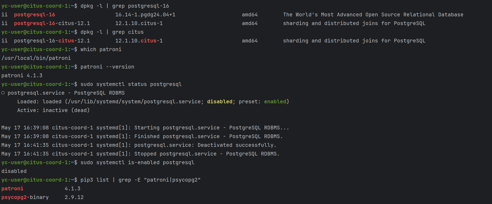
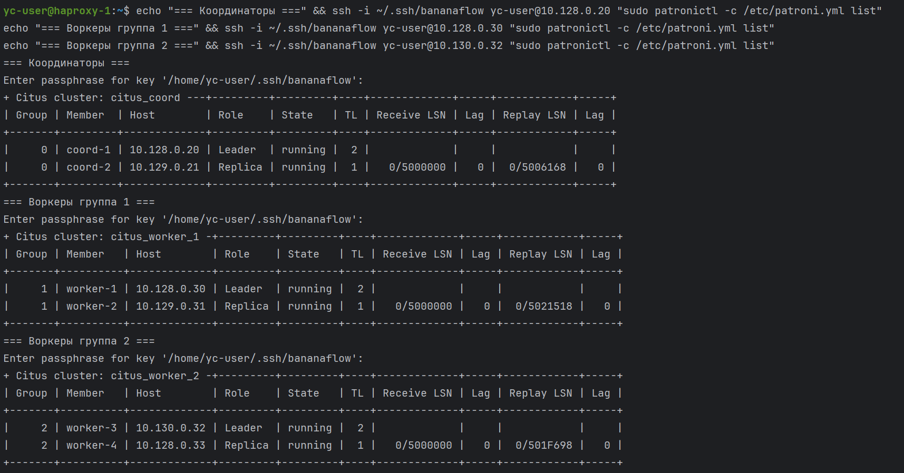
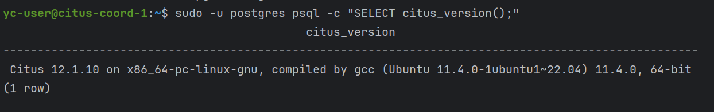
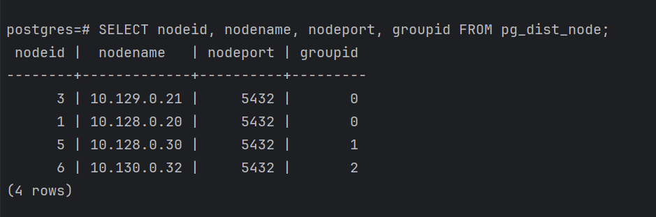
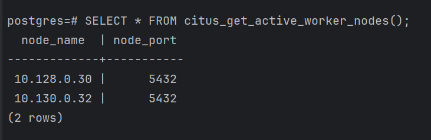
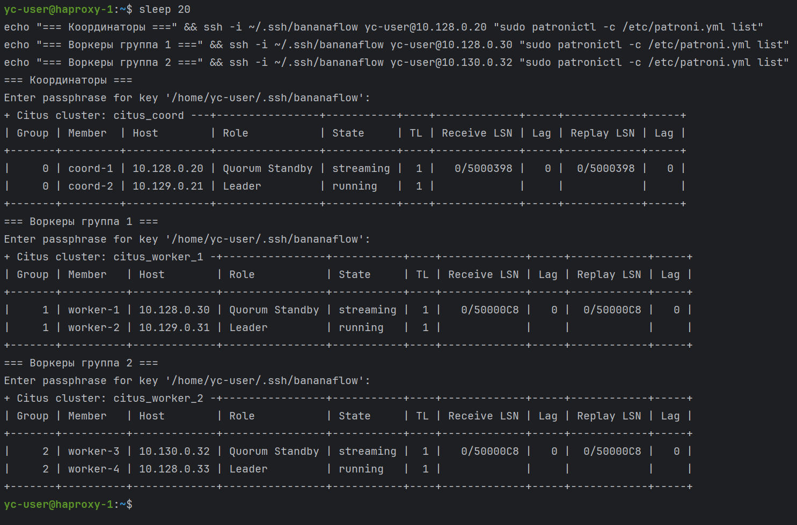
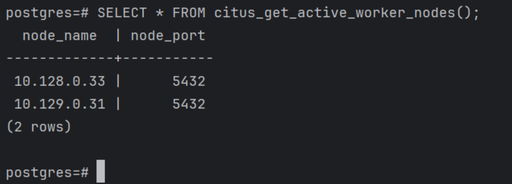

# Установка PostgreSQL 16, Citus, Patroni (на всех 6 узлах БД)
На каждом узле устанавливается PostgreSQL 16, репозиторий Citus (с заменой noble на jammy для совместимости), Python pip, Patroni с поддержкой etcd3. Стандартный PostgreSQL останавливается и отключается, так как Patroni будет сам управлять процессами.

```
ssh -i ~/.ssh/bananaflow yc-user@10.128.0.20
sudo apt update
sudo apt install -y postgresql-16
curl https://install.citusdata.com/community/deb.sh | sudo bash
sudo sed -i 's/noble/jammy/g' /etc/apt/sources.list.d/citusdata_community.list
```
Было:
```
deb [signed-by=/etc/apt/keyrings/citusdata_community-archive-keyring.gpg] https://repos.citusdata.com/community/ubuntu/ noble main
deb-src [signed-by=/etc/apt/keyrings/citusdata_community-archive-keyring.gpg] https://repos.citusdata.com/community/ubuntu/ noble main
```
Стало:
```
deb [signed-by=/etc/apt/keyrings/citusdata_community-archive-keyring.gpg] https://repos.citusdata.com/community/ubuntu/ jammy main
deb-src [signed-by=/etc/apt/keyrings/citusdata_community-archive-keyring.gpg] https://repos.citusdata.com/community/ubuntu/ jammy main
```
```
sudo apt update
sudo apt install -y postgresql-16-citus-12.1
sudo apt install -y python3-pip
sudo pip3 install --break-system-packages patroni[etcd] psycopg2-binary
sudo systemctl stop postgresql
sudo systemctl disable postgresql
```
Проверка на узле, что все корректно установилось, + pg выключен:


Проверка:
```
dpkg -l | grep postgresql-16
dpkg -l | grep citus
which patroni
patroni --version
sudo systemctl status postgresql
sudo systemctl is-enabled postgresql
pip3 list | grep -E "patroni|psycopg2"
```

Аналогичные команды выполняем на других узлах:
```
ssh -i ~/.ssh/bananaflow yc-user@10.129.0.21
sudo apt update
sudo apt install -y postgresql-16
curl https://install.citusdata.com/community/deb.sh | sudo bash
sudo sed -i 's/noble/jammy/g' /etc/apt/sources.list.d/citusdata_community.list
sudo apt update
sudo apt install -y postgresql-16-citus-12.1 python3-pip
sudo pip3 install --break-system-packages patroni[etcd] psycopg2-binary
sudo systemctl stop postgresql
sudo systemctl disable postgresql
exit
```
```
ssh -i ~/.ssh/bananaflow yc-user@10.128.0.30
sudo apt update
sudo apt install -y postgresql-16
curl https://install.citusdata.com/community/deb.sh | sudo bash
sudo sed -i 's/noble/jammy/g' /etc/apt/sources.list.d/citusdata_community.list
sudo apt update
sudo apt install -y postgresql-16-citus-12.1 python3-pip
sudo pip3 install --break-system-packages patroni[etcd] psycopg2-binary
sudo systemctl stop postgresql
sudo systemctl disable postgresql
exit
```
```
ssh -i ~/.ssh/bananaflow yc-user@10.129.0.31
sudo apt update
sudo apt install -y postgresql-16
curl https://install.citusdata.com/community/deb.sh | sudo bash
sudo sed -i 's/noble/jammy/g' /etc/apt/sources.list.d/citusdata_community.list
sudo apt update
sudo apt install -y postgresql-16-citus-12.1 python3-pip
sudo pip3 install --break-system-packages patroni[etcd] psycopg2-binary
sudo systemctl stop postgresql
sudo systemctl disable postgresql
exit
```
```
ssh -i ~/.ssh/bananaflow yc-user@10.130.0.32
sudo apt update
sudo apt install -y postgresql-16
curl https://install.citusdata.com/community/deb.sh | sudo bash
sudo sed -i 's/noble/jammy/g' /etc/apt/sources.list.d/citusdata_community.list
sudo apt update
sudo apt install -y postgresql-16-citus-12.1 python3-pip
sudo pip3 install --break-system-packages patroni[etcd] psycopg2-binary
sudo systemctl stop postgresql
sudo systemctl disable postgresql
exit
```
```
ssh -i ~/.ssh/bananaflow yc-user@10.128.0.33
sudo apt update
sudo apt install -y postgresql-16
curl https://install.citusdata.com/community/deb.sh | sudo bash
sudo sed -i 's/noble/jammy/g' /etc/apt/sources.list.d/citusdata_community.list
sudo apt update
sudo apt install -y postgresql-16-citus-12.1 python3-pip
sudo pip3 install --break-system-packages patroni[etcd] psycopg2-binary
sudo systemctl stop postgresql
sudo systemctl disable postgresql
exit
```
# Конфигурация Patroni (на 6 узлах)
Для координаторов (группа 0) и для двух групп воркеров (группы 1 и 2) создаются конфиги /etc/patroni.yml
- У координаторов scope: citus_coord, citus.group: 0
- У воркеров первой группы scope: citus_worker_1, citus.group: 1
- У воркеров второй группы scope: citus_worker_2, citus.group: 2
В секции bootstrap указан method: initdb, необходимые параметры PostgreSQL (shared_preload_libraries = 'citus'), а также post_init скрипт, который при первой инициализации создаёт пользователя replicator, задаёт пароль postgres и активирует расширение Citus

Несколько деталей:
- В новых версиях etcd (≥3.4) API v2 устарел и часто отключён. Patroni по умолчанию пытается использовать API v2, поэтому установлен Python-пакет etcd3 и переключен Patroni на etcd3
- Дополнительно включен ETCD_ENABLE_V2=true в etcd – это дало возможность использовать старый API v2 как fallback, что упростило отладку
- Наличие bootstrap у реплик: patroni на реплике не выполняет initdb, так как каталог данных уже существует или будет склонирован от лидера. Но если реплика когда-нибудь станет лидером, у неё уже будут все необходимые параметры (shared_preload_libraries, post_init и т.д.)

```
ssh -i ~/.ssh/bananaflow yc-user@10.128.0.20
sudo tee /etc/patroni.yml <<EOF
scope: citus_coord
name: coord-1

etcd3:
  hosts:
    - "10.128.0.10:2379"

restapi:
  listen: "0.0.0.0:8008"
  connect_address: "10.128.0.20:8008"

bootstrap:
  method: initdb
  initdb:
    - encoding: UTF8
    - data-checksums
  pg_hba:
    - local all all trust
    - host all all 127.0.0.1/32 trust
    - host all all 0.0.0.0/0 md5
    - host replication replicator 0.0.0.0/0 md5
  post_init: |
    #!/bin/bash
    for i in {1..60}; do
      if /usr/lib/postgresql/16/bin/psql -c "SELECT 1;" >/dev/null 2>&1; then
        /usr/lib/postgresql/16/bin/psql -c "CREATE USER replicator WITH REPLICATION PASSWORD 'rep-pass';"
        /usr/lib/postgresql/16/bin/psql -c "ALTER USER postgres PASSWORD 'postgres-pass';"
        /usr/lib/postgresql/16/bin/psql -c "CREATE EXTENSION IF NOT EXISTS citus;" && break
      fi
      sleep 1
    done
  dcs:
    ttl: 30
    loop_wait: 10
    retry_timeout: 10
    maximum_lag_on_failover: 1048576
    postgresql:
      use_pg_rewind: true
      parameters:
        shared_preload_libraries: citus
        wal_level: logical
        max_replication_slots: 10
        max_connections: 200

postgresql:
  listen: "0.0.0.0:5432"
  connect_address: "10.128.0.20:5432"
  data_dir: /var/lib/postgresql/16/main
  bin_dir: /usr/lib/postgresql/16/bin
  pgpass: /var/lib/postgresql/.pgpass
  authentication:
    replication:
      username: replicator
      password: rep-pass
    superuser:
      username: postgres
      password: postgres-pass
  parameters:
    shared_preload_libraries: citus

citus:
  group: 0
  database: postgres

tags:
  nofailover: false
EOF
```
```
ssh -i ~/.ssh/bananaflow yc-user@10.129.0.21
sudo tee /etc/patroni.yml <<EOF
scope: citus_coord
name: coord-2

etcd3:
  hosts:
    - "10.128.0.10:2379"

restapi:
  listen: "0.0.0.0:8008"
  connect_address: "10.129.0.21:8008"

bootstrap:
  method: initdb
  initdb:
    - encoding: UTF8
    - data-checksums
  pg_hba:
    - local all all trust
    - host all all 127.0.0.1/32 trust
    - host all all 0.0.0.0/0 md5
    - host replication replicator 0.0.0.0/0 md5
  post_init: |
    #!/bin/bash
    for i in {1..60}; do
      if /usr/lib/postgresql/16/bin/psql -c "SELECT 1;" >/dev/null 2>&1; then
        /usr/lib/postgresql/16/bin/psql -c "CREATE USER replicator WITH REPLICATION PASSWORD 'rep-pass';"
        /usr/lib/postgresql/16/bin/psql -c "ALTER USER postgres PASSWORD 'postgres-pass';"
        /usr/lib/postgresql/16/bin/psql -c "CREATE EXTENSION IF NOT EXISTS citus;" && break
      fi
      sleep 1
    done
  dcs:
    ttl: 30
    loop_wait: 10
    retry_timeout: 10
    maximum_lag_on_failover: 1048576
    postgresql:
      use_pg_rewind: true
      parameters:
        shared_preload_libraries: citus
        wal_level: logical
        max_replication_slots: 10
        max_connections: 200

postgresql:
  listen: "0.0.0.0:5432"
  connect_address: "10.129.0.21:5432"
  data_dir: /var/lib/postgresql/16/main
  bin_dir: /usr/lib/postgresql/16/bin
  pgpass: /var/lib/postgresql/.pgpass
  authentication:
    replication:
      username: replicator
      password: rep-pass
    superuser:
      username: postgres
      password: postgres-pass
  parameters:
    shared_preload_libraries: citus

citus:
  group: 0
  database: postgres

tags:
  nofailover: false
EOF
```
```
ssh -i ~/.ssh/bananaflow yc-user@10.128.0.30
sudo tee /etc/patroni.yml <<EOF
scope: citus_worker_1
name: worker-1

etcd3:
  hosts:
    - "10.128.0.10:2379"

restapi:
  listen: "0.0.0.0:8008"
  connect_address: "10.128.0.30:8008"

bootstrap:
  method: initdb
  initdb:
    - encoding: UTF8
    - data-checksums
  pg_hba:
    - local all all trust
    - host all all 127.0.0.1/32 trust
    - host all all 0.0.0.0/0 md5
    - host replication replicator 0.0.0.0/0 md5
  post_init: |
    #!/bin/bash
    for i in {1..60}; do
      if /usr/lib/postgresql/16/bin/psql -c "SELECT 1;" >/dev/null 2>&1; then
        /usr/lib/postgresql/16/bin/psql -c "CREATE USER replicator WITH REPLICATION PASSWORD 'rep-pass';"
        /usr/lib/postgresql/16/bin/psql -c "ALTER USER postgres PASSWORD 'postgres-pass';"
        /usr/lib/postgresql/16/bin/psql -c "CREATE EXTENSION IF NOT EXISTS citus;" && break
      fi
      sleep 1
    done
  dcs:
    ttl: 30
    loop_wait: 10
    retry_timeout: 10
    maximum_lag_on_failover: 1048576
    postgresql:
      use_pg_rewind: true
      parameters:
        shared_preload_libraries: citus
        wal_level: logical
        max_replication_slots: 10
        max_connections: 200

postgresql:
  listen: "0.0.0.0:5432"
  connect_address: "10.128.0.30:5432"
  data_dir: /var/lib/postgresql/16/main
  bin_dir: /usr/lib/postgresql/16/bin
  pgpass: /var/lib/postgresql/.pgpass
  authentication:
    replication:
      username: replicator
      password: rep-pass
    superuser:
      username: postgres
      password: postgres-pass
  parameters:
    shared_preload_libraries: citus

citus:
  group: 1
  database: postgres

tags:
  nofailover: false
EOF
```
```
ssh -i ~/.ssh/bananaflow yc-user@10.129.0.31
sudo tee /etc/patroni.yml <<EOF
scope: citus_worker_1
name: worker-2

etcd3:
  hosts:
    - "10.128.0.10:2379"

restapi:
  listen: "0.0.0.0:8008"
  connect_address: "10.129.0.31:8008"

bootstrap:
  method: initdb
  initdb:
    - encoding: UTF8
    - data-checksums
  pg_hba:
    - local all all trust
    - host all all 127.0.0.1/32 trust
    - host all all 0.0.0.0/0 md5
    - host replication replicator 0.0.0.0/0 md5
  post_init: |
    #!/bin/bash
    for i in {1..60}; do
      if /usr/lib/postgresql/16/bin/psql -c "SELECT 1;" >/dev/null 2>&1; then
        /usr/lib/postgresql/16/bin/psql -c "CREATE USER replicator WITH REPLICATION PASSWORD 'rep-pass';"
        /usr/lib/postgresql/16/bin/psql -c "ALTER USER postgres PASSWORD 'postgres-pass';"
        /usr/lib/postgresql/16/bin/psql -c "CREATE EXTENSION IF NOT EXISTS citus;" && break
      fi
      sleep 1
    done
  dcs:
    ttl: 30
    loop_wait: 10
    retry_timeout: 10
    maximum_lag_on_failover: 1048576
    postgresql:
      use_pg_rewind: true
      parameters:
        shared_preload_libraries: citus
        wal_level: logical
        max_replication_slots: 10
        max_connections: 200

postgresql:
  listen: "0.0.0.0:5432"
  connect_address: "10.129.0.31:5432"
  data_dir: /var/lib/postgresql/16/main
  bin_dir: /usr/lib/postgresql/16/bin
  pgpass: /var/lib/postgresql/.pgpass
  authentication:
    replication:
      username: replicator
      password: rep-pass
    superuser:
      username: postgres
      password: postgres-pass
  parameters:
    shared_preload_libraries: citus

citus:
  group: 1
  database: postgres

tags:
  nofailover: false
EOF
```
```
ssh -i ~/.ssh/bananaflow yc-user@10.130.0.32
sudo tee /etc/patroni.yml <<EOF
scope: citus_worker_2
name: worker-3

etcd3:
  hosts:
    - "10.128.0.10:2379"

restapi:
  listen: "0.0.0.0:8008"
  connect_address: "10.130.0.32:8008"

bootstrap:
  method: initdb
  initdb:
    - encoding: UTF8
    - data-checksums
  pg_hba:
    - local all all trust
    - host all all 127.0.0.1/32 trust
    - host all all 0.0.0.0/0 md5
    - host replication replicator 0.0.0.0/0 md5
  post_init: |
    #!/bin/bash
    for i in {1..60}; do
      if /usr/lib/postgresql/16/bin/psql -c "SELECT 1;" >/dev/null 2>&1; then
        /usr/lib/postgresql/16/bin/psql -c "CREATE USER replicator WITH REPLICATION PASSWORD 'rep-pass';"
        /usr/lib/postgresql/16/bin/psql -c "ALTER USER postgres PASSWORD 'postgres-pass';"
        /usr/lib/postgresql/16/bin/psql -c "CREATE EXTENSION IF NOT EXISTS citus;" && break
      fi
      sleep 1
    done
  dcs:
    ttl: 30
    loop_wait: 10
    retry_timeout: 10
    maximum_lag_on_failover: 1048576
    postgresql:
      use_pg_rewind: true
      parameters:
        shared_preload_libraries: citus
        wal_level: logical
        max_replication_slots: 10
        max_connections: 200

postgresql:
  listen: "0.0.0.0:5432"
  connect_address: "10.130.0.32:5432"
  data_dir: /var/lib/postgresql/16/main
  bin_dir: /usr/lib/postgresql/16/bin
  pgpass: /var/lib/postgresql/.pgpass
  authentication:
    replication:
      username: replicator
      password: rep-pass
    superuser:
      username: postgres
      password: postgres-pass
  parameters:
    shared_preload_libraries: citus

citus:
  group: 2
  database: postgres

tags:
  nofailover: false
EOF
```
```
ssh -i ~/.ssh/bananaflow yc-user@10.128.0.33
sudo tee /etc/patroni.yml <<EOF
scope: citus_worker_2
name: worker-4

etcd3:
  hosts:
    - "10.128.0.10:2379"

restapi:
  listen: "0.0.0.0:8008"
  connect_address: "10.128.0.33:8008"

bootstrap:
  method: initdb
  initdb:
    - encoding: UTF8
    - data-checksums
  pg_hba:
    - local all all trust
    - host all all 127.0.0.1/32 trust
    - host all all 0.0.0.0/0 md5
    - host replication replicator 0.0.0.0/0 md5
  post_init: |
    #!/bin/bash
    for i in {1..60}; do
      if /usr/lib/postgresql/16/bin/psql -c "SELECT 1;" >/dev/null 2>&1; then
        /usr/lib/postgresql/16/bin/psql -c "CREATE USER replicator WITH REPLICATION PASSWORD 'rep-pass';"
        /usr/lib/postgresql/16/bin/psql -c "ALTER USER postgres PASSWORD 'postgres-pass';"
        /usr/lib/postgresql/16/bin/psql -c "CREATE EXTENSION IF NOT EXISTS citus;" && break
      fi
      sleep 1
    done
  dcs:
    ttl: 30
    loop_wait: 10
    retry_timeout: 10
    maximum_lag_on_failover: 1048576
    postgresql:
      use_pg_rewind: true
      parameters:
        shared_preload_libraries: citus
        wal_level: logical
        max_replication_slots: 10
        max_connections: 200

postgresql:
  listen: "0.0.0.0:5432"
  connect_address: "10.128.0.33:5432"
  data_dir: /var/lib/postgresql/16/main
  bin_dir: /usr/lib/postgresql/16/bin
  pgpass: /var/lib/postgresql/.pgpass
  authentication:
    replication:
      username: replicator
      password: rep-pass
    superuser:
      username: postgres
      password: postgres-pass
  parameters:
    shared_preload_libraries: citus

citus:
  group: 2
  database: postgres

tags:
  nofailover: false
EOF
```
# Systemd-сервис Patroni (на всех 6 узлах)
На каждом узле:
- ssh -i ~/.ssh/bananaflow yc-user@10.128.0.20
- ssh -i ~/.ssh/bananaflow yc-user@10.128.0.30
- ssh -i ~/.ssh/bananaflow yc-user@10.130.0.32
- ssh -i ~/.ssh/bananaflow yc-user@10.129.0.21
- ssh -i ~/.ssh/bananaflow yc-user@10.129.0.31
- ssh -i ~/.ssh/bananaflow yc-user@10.128.0.33

Выполняем следующие команды:
```
sudo tee /etc/systemd/system/patroni.service <<EOF
[Unit]
Description=Patroni HA for PostgreSQL
After=network.target

[Service]
Type=simple
User=postgres
Group=postgres
ExecStart=/usr/local/bin/patroni /etc/patroni.yml
Restart=on-failure
RestartSec=5

[Install]
WantedBy=multi-user.target
EOF

sudo systemctl daemon-reload
sudo systemctl enable patroni
```
# Запуск кластера
Запускаем лидеров
```
ssh -i ~/.ssh/bananaflow yc-user@10.128.0.20 "sudo systemctl start patroni"
ssh -i ~/.ssh/bananaflow yc-user@10.128.0.30 "sudo systemctl start patroni"
ssh -i ~/.ssh/bananaflow yc-user@10.130.0.32 "sudo systemctl start patroni"
```
Запускаем реплики
```
ssh -i ~/.ssh/bananaflow yc-user@10.129.0.21 "sudo systemctl start patroni"
ssh -i ~/.ssh/bananaflow yc-user@10.129.0.31 "sudo systemctl start patroni"
ssh -i ~/.ssh/bananaflow yc-user@10.128.0.33 "sudo systemctl start patroni"
```
# Проверка состояния кластера
Команда patronictl list показывает роли и состояние каждого узла в группе
```
ssh -i ~/.ssh/bananaflow yc-user@10.128.0.20
sudo patronictl -c /etc/patroni.yml list
```



Список воркеров:




# Имитация падения координатора и 2 воркеров, которые являются лидерами:
Останавливаем Patroni на лидере координаторов (coord-1) и на лидерах воркеров (worker-1, worker-3). Patroni на репликах должен автоматически взять на себя роль лидера. Проверяем через patronictl list, а также через SQL-запросы к Citus, что кластер остаётся доступен
```
ssh -i ~/.ssh/bananaflow yc-user@10.128.0.20 "sudo systemctl stop patroni"
ssh -i ~/.ssh/bananaflow yc-user@10.128.0.30 "sudo systemctl stop patroni"
ssh -i ~/.ssh/bananaflow yc-user@10.130.0.32 "sudo systemctl stop patroni"
```
Восстанавливаем:
```
ssh -i ~/.ssh/bananaflow yc-user@10.128.0.20 "sudo systemctl start patroni"
ssh -i ~/.ssh/bananaflow yc-user@10.128.0.30 "sudo systemctl start patroni"
ssh -i ~/.ssh/bananaflow yc-user@10.130.0.32 "sudo systemctl start patroni"
```
Проверка переключения:


citus_get_active_worker_nodes()  показывает новые IP лидеров (10.129.0.31 и 10.128.0.33). Если автоматическое обновление бы не произошло, то можно было бы выполнить ручное обновление (citus_remove_node, citus_add_node)


