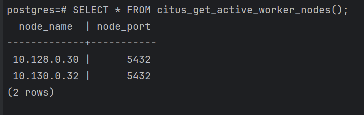
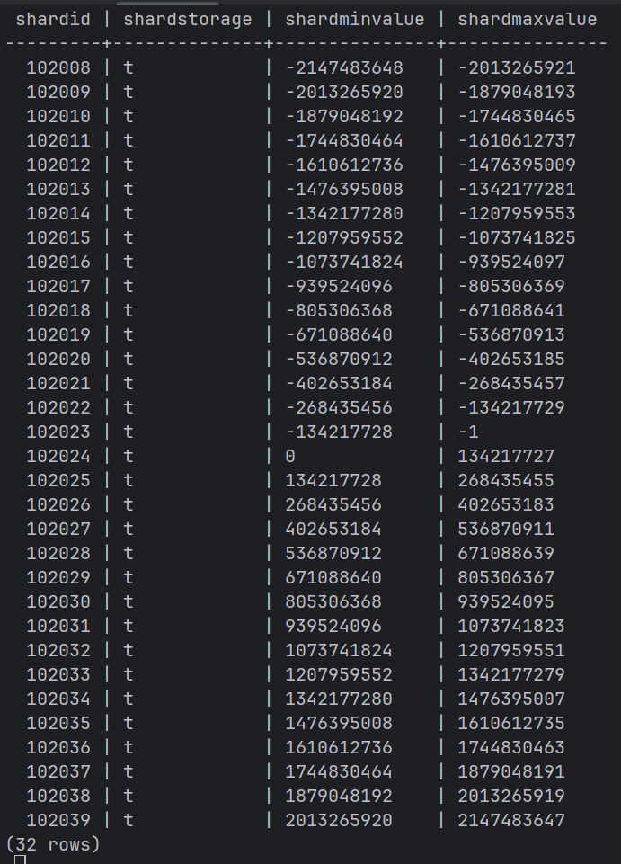
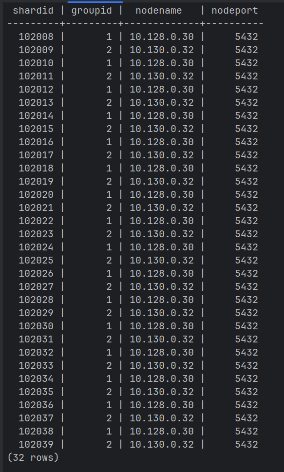
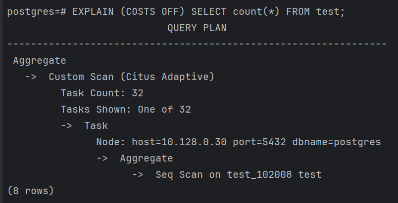
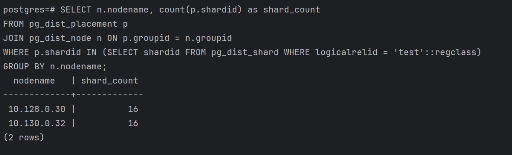
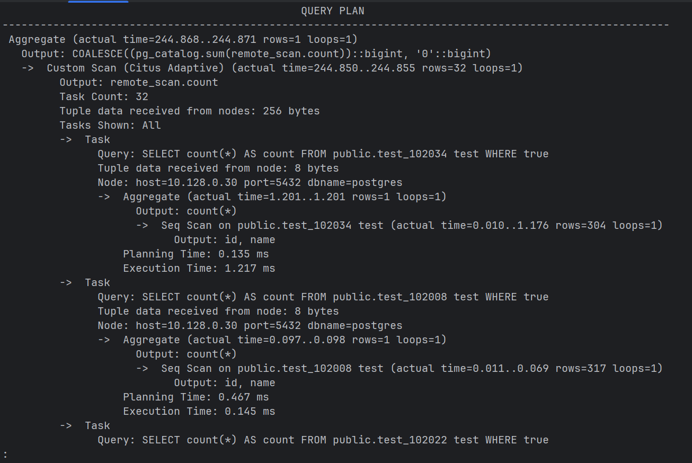
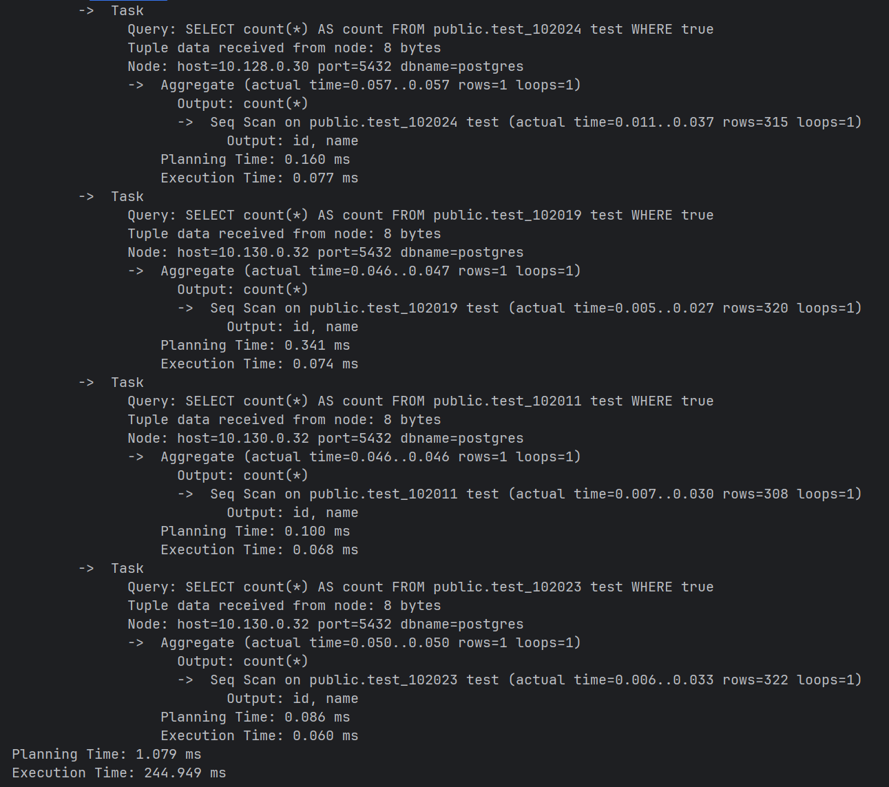

# Тестирование распределённой работы Citus
Необходимо убедиться, что Citus корректно шардирует данные между рабочими узлами, равномерно распределяет шарды, обрабатывает распределённые запросы и правильно отражает план выполнения с участием обоих воркеров

Команды выполняются на координаторе citus-coord-1:
```
ssh -i ~/.ssh/bananaflow yc-user@10.128.0.20
psql -U postgres
```
Проверка активных рабочих узлов
```
SELECT * FROM citus_get_active_worker_nodes();
```


Создание распределённой таблицы и информация о шардах
```
CREATE TABLE test (id int primary key, name text);
SELECT create_distributed_table('test', 'id');
INSERT INTO test SELECT generate_series(1,100), 'test';
SELECT shardid, shardstorage, shardminvalue, shardmaxvalue 
FROM pg_dist_shard 
WHERE logicalrelid = 'test'::regclass;
```


Распределение шардов по физическим узлам
```
SELECT p.shardid, p.groupid, n.nodename, n.nodeport
FROM pg_dist_placement p
JOIN pg_dist_node n ON p.groupid = n.groupid
WHERE p.shardid IN (SELECT shardid FROM pg_dist_shard WHERE logicalrelid = 'test'::regclass)
ORDER BY p.shardid;
```


План выполнения простого запроса
```
EXPLAIN (COSTS OFF) SELECT count(*) FROM test;
```


Масштабирование до 10 000 строк
```
INSERT INTO test
SELECT generate_series(101, 10000), 'row_' || generate_series(101, 10000);
```
Статистика количества шардов на каждом узле
```
SELECT n.nodename, count(p.shardid) as shard_count
FROM pg_dist_placement p
JOIN pg_dist_node n ON p.groupid = n.groupid
WHERE p.shardid IN (SELECT shardid FROM pg_dist_shard WHERE logicalrelid = 'test'::regclass)
GROUP BY n.nodename;
```


Детальный план запроса с показом всех задач; citus.explain_all_tasks = on заставляет Citus показывать план для каждого шарда
```
SET citus.explain_all_tasks TO on;
EXPLAIN (ANALYZE, VERBOSE, COSTS OFF) SELECT count(*) FROM test;
SET citus.explain_all_tasks TO off;
```

